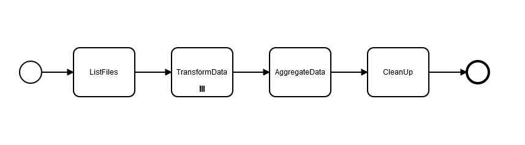
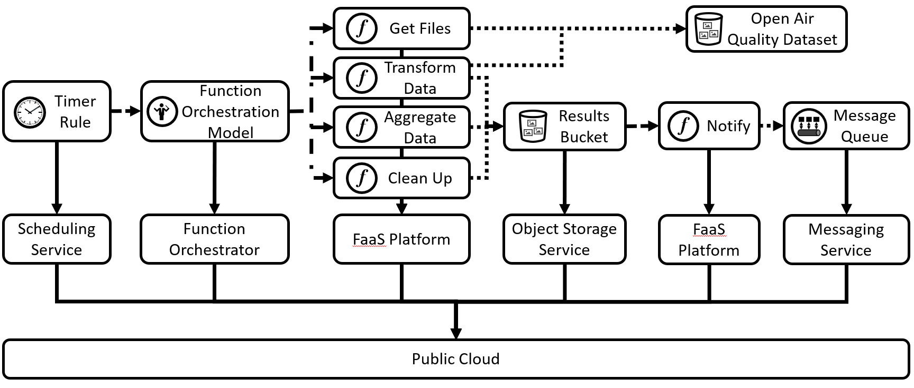
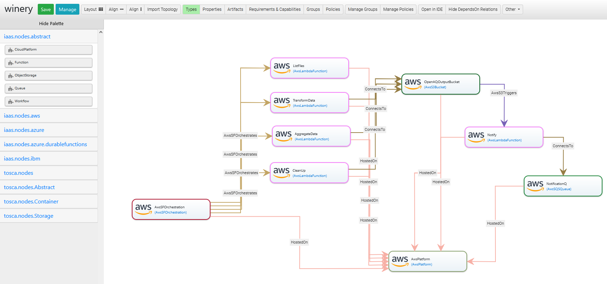
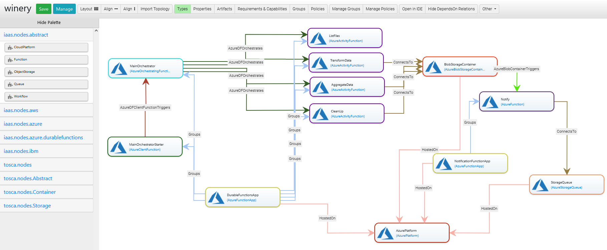
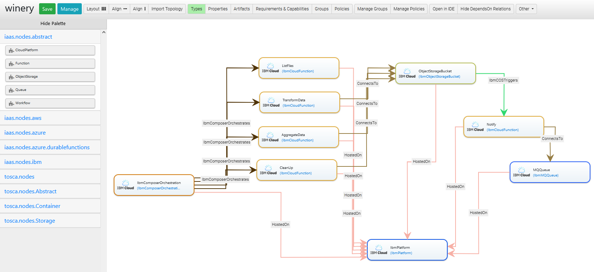

# Standards-based Modeling and Deployment of Function Orchestrations: Case Study 
This project comprises code artifacts implementing a case study showcasing the usage of BPMN and TOSCA for modeling serverless function orchestrations and their automated deployment.
The function orchestration used for the case study is an extract-transform-load pipeline for processing the Open Air Quality data.
This ETL function orchestration is combined with several standalone serverless components in an example serverless application that combines event-driven behavior with a function orchestration.

The ETL function orchestration is first modeled in BPMN and then transformed into three target function orchestration model formats, namely *Amazon States Language model* for [AWS Step Functions](https://aws.amazon.com/step-functions), a Pyton-based *Orchestrating Function* for [Azure Durable Functions](https://docs.microsoft.com/en-us/azure/azure-functions/durable), and a JavaScript-based *composition* for [IBM Composer](https://github.com/ibm-functions/composer).
Resulting technology-specific function orchestration models are then used in TOSCA-based deployment models to automatically deploy serverless applications to AWS, Azure, and IBM using the open source TOSCA deployment technology [xOpera](https://github.com/xlab-si/xopera-opera).
Below, we describe the ETL function orchestration, the abstract deployment architecture, and the provider-specific implementation details for the ETL function orchestration and the deployment architecture.

## 1. Open Air Quality ETL Function Orchestration Modeled with BPMN

The ETL function orchestration is a *BPMN Sequence*, which comprises four functions: (1) ListFiles, (2) TransformData, (3) AggregateData, and (4) CleanUp.
The *ListFiles* function collects the names of publicly-available air quality data files for the previous day and splits them in chunks. Afterwards, one instance of the *TransformData* activity is invoked for each chunk - to normalize and process the data, and to store these results as intermediary files. The *AggregateData* activity is invoked to aggregate the intermediary files and store a final .csv file when all transformations are completed. Finally, the *CleanUp* activity removes the intermediary files as the final activity of this workflow.

This function orchestration model is based on [this example from AWS-samples repository](https://github.com/aws-samples/aws-lambda-etl-ref-architecture), which processes the global air quality data available in the AWS registry for open data (see [OpenAQ](https://registry.opendata.aws/openaq/)).
This function orchestration extracts-transforms-loads the the minimum, maximum and average ratings for air quality measurements on a daily basis.

Using our [BPMN4FO prototype](https://github.com/iaas-splab/matoswo), this BPMN-based function orchestration model is then transformed into three target function orchestration model formats, namely *Amazon States Language model* for [AWS Step Functions](https://aws.amazon.com/step-functions), a Pyton-based *Orchestrating Function* for [Azure Durable Functions](https://docs.microsoft.com/en-us/azure/azure-functions/durable), and a JavaScript-based *composition* for [IBM Composer](https://github.com/ibm-functions/composer).
Resulting technology-specific function orchestration models (see the `orchestration-models` folder) are then used as parts of a larger serverless application, which we describe next.

## 2. Deployment Architecture
To combine event-driven and orchestrated behavior, we consider the deployment architecture as shown in the figure below.
Here, the ETL function orchestration model together with four to-be-orchestrated functions are invoked on a sheculed basis.
Furthermore, after the orchestration is finished, the *Notify* function is triggered as soon as the the final results file is stored in the object storage bucket.
This function generates and stored notification messages in the message queue for notifying any external clients interested in the final results.

In the following, we describe how this deployment architecture is implemented for three cloud providers, namely AWS, Azure, and IBM.
Further, we provide the details on the implemented TOSCA-based deployment models and how to enact them using [xOpera](https://github.com/xlab-si/xopera-opera).
These TOSCA models are available in the `definitions-tosca/servicetemplates` folder in the root of this repository, together with the instructions how to execute them with xOpera.

## 3. Implementation Details
Here, we highlight relevant implementation details related to each provider-specific implementation.

### 3.1 Implementation for AWS
The implementation for AWS uses the following service offreings: AWS Lambda to host functions, AWS Step Functions to host function orchestration models, AWS S3 as the object storage offering, and AWS SQS as the messaging offering.
The corresponding deployment model shown below is based on the [TOSCA specification](https://docs.oasis-open.org/tosca/TOSCA-Simple-Profile-YAML/v1.3/TOSCA-Simple-Profile-YAML-v1.3.html) and is created using Eclipse Winery, a graphical modeling tool for representing TOSCA application topologies. 

#### Function Orchestration Implementation Details
All functions are implemented in Python for AWS Lambda; the ASL-based function orchestration model is generated from the BPMN model and hosted on AWS Step Functions.

#### ListFiles function (Extract Phase)
The ListFiles function is a [Task](https://docs.aws.amazon.com/step-functions/latest/dg/amazon-states-language-task-state.html) state. 
This function lists the contents of the OpenAQ S3 bucket (openaq-fetches) for the previous day and groups the files into a set of chunks (12 files per chunk by default) which are then processed in parallel during the transform phase.
The chunk size can be changed by providing a property 'chunk_size' in the input object, e.g., { "chunk_size": 8 }

#### TransformData function (Transform Phase)
The TransformData function is a [Map](https://docs.aws.amazon.com/step-functions/latest/dg/amazon-states-language-map-state.html) state. 
The Map state allows executing the same sequence of transformations for each element of the input array.
The key transformations in the state involve using the Python `Pandas` library to flatten the raw JSON data, extract relevant columns and deduplicate the data. The output of this state is a list of S3 locations to the intermediate files generated by each of the Map task executions. The files are written to S3 because the data exceeds the maximum limit for Step Functions result data size.

#### AggregateData function (Load Phase)
The AggregateData function is a [Task](https://docs.aws.amazon.com/step-functions/latest/dg/amazon-states-language-task-state.html) state. This function downloads the files generated by the transform phase, combines them and calculates the summary statistics.
This step uses the Python `Pandas` and `Numpy` libraries to resample the hourly timeseries data and calculate daily minimum, maximum and average values of air quality ratings. The data is summarized by location, city and country. This is written as a gzipped CSV file to S3.

#### CleanUp function
A [Task](https://docs.aws.amazon.com/step-functions/latest/dg/amazon-states-language-task-state.html) deletes the S3 files created by the transform phase. This step is invoked regardless of whether the load phase succeeds or not.

### 3.2 Implementation for Azure

The implementation for Azure uses the following service offreings: Azure Functions to host functions, Azure Durable Functions to host function orchestration models, Azure Blob Storage as the object storage offering, and Azure Storage Queue as the messaging offering.
The model created in Winery is shown below:

#### Function Orchestration Implementation Details
All functions are implemented in Python for Azure Functions; the Python-based *Orchestrating Function* is generated from the BPMN model and enacted using Azure Durable Functions.
Apart from accessing Azure Blob Storage Containers and Azure Storage Queue, the function implementations are identical to the AWS implementations.
Implementation for Azure Durable Functions also contains the Client Function, which triggers the Orchestrating function, since it is not possible to trigger it directly.
Furthermore, since functions in Azure Functions are deployed as parts of *AzureFunctionApps*, the function orchestration and the Notify function are implemented as separate *AzureFunctionApps*.

### 3.3 Implementation for IBM

The implementation for IBM uses the following service offreings: IBM Cloud Functions to host functions, IBM Composer to enact function orchestration models, IBM Cloud Object Storage as the object storage offering, and IBM MQ Cloud as the messaging offering.

#### Function Orchestration Implementation Details
All functions are implemented in Python for IBM Cloud Functions; the JavaScript-based *composition* is generated from the BPMN model and enacted using IBM Composer.
An internal Redis instance needs to be referenced to enable running `parallel` and `map` combinators in IBM Composer.
Since we have a Fan-out task for running the `TransformData` functions in parallel, such Redis instance is assumed to be available.
The information on how to reference it is provided in the corresponding TOSCA Service Template located in the `definitions-tosca` folder with TOSCA types hierarchy enabling function orchestration modeling.

